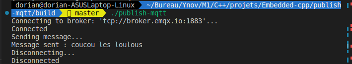
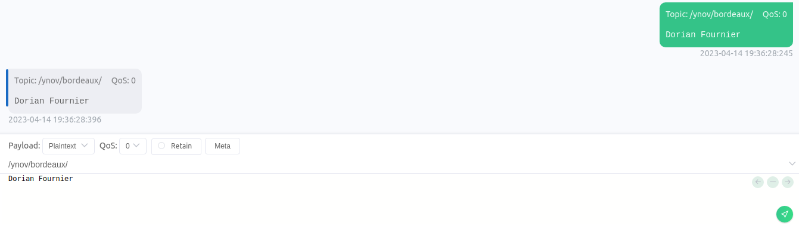
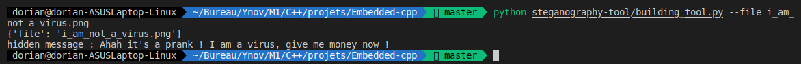
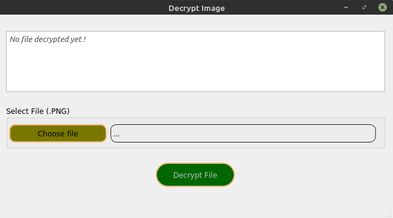
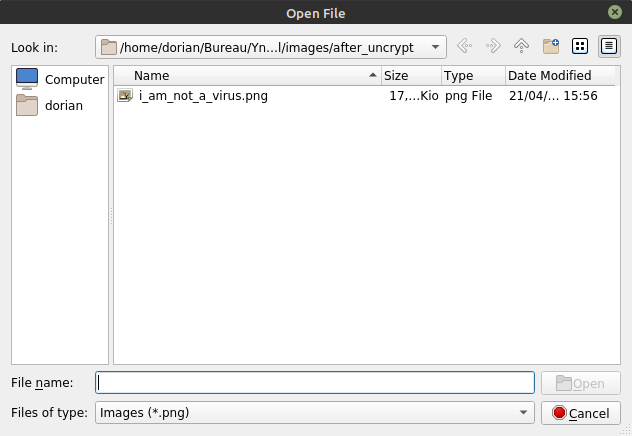
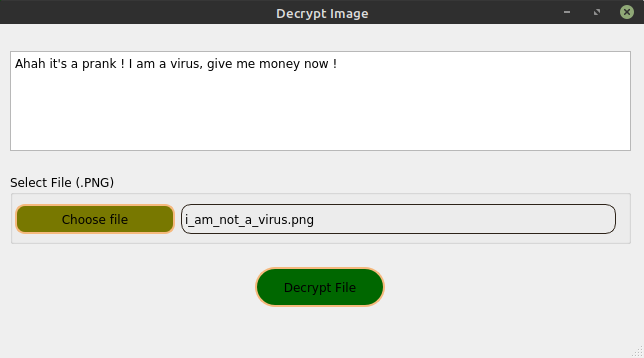

<div id="top"></div>

<details>
  <summary>Summary</summary>
  <ol>
    <li><a href="#mqtt-with-c">MQTT with C++</a></li>
    <li><a href="#stenography-with-c">Stenography with C++</a></li>
  </ol>
</details>

# MQTT with C++

<details>
  <summary>Table of Contents</summary>
  <ol>
    <li><a href="#prerequisites">Prerequisites</a></li>
    <li><a href="#how-to-build">How to build</a></li>
    <li><a href="#how-to-launch-program">How to launch program</a></li>
    <li><a href="#result-for-receive-mqtt">Result for receive-mqtt</a></li>
    <li><a href="#result-for-publish-mqtt">Result for publish-mqtt</a></li>
    <li><a href="#publish-message-with-mqtt-x">Publish message with MQTT X</a></li>
  </ol>
</details>

## Prerequisites

- clone the repository : ```git clone https://github.com/DorianFournier/Embedded-cpp```
- go to the root directory : ```cd Embedded-cpp```

<p align="right"><a href="#top">:point_up_2:</a></p>

## How to build
> Same for publish-mqtt or receive-mqtt directory

1. go to publish-mqtt or receive-mqtt directory : ```cd publish-mqtt``` or ```cd receive-mqtt```
2. create **build** directory : ```mkdir build``` 
3. go to **build** directory : ```cd build```
4. run : ```cmake ..```
5. run : ```make```

<p align="right"><a href="#top">:point_up_2:</a></p>

## How to launch program 

1. go to build directory : ```cd build```
2. run : ```./build/receive-mqtt``` or ```./build/publish-mqtt```

<p align="right"><a href="#top">:point_up_2:</a></p>

## Result for receive-mqtt 
<div align="center">
  </br>
  
  </br></br>
</div>

<p align="right"><a href="#top">:point_up_2:</a></p>

## Result for publish-mqtt
<div align="center">
  </br>
  
  </br></br>
</div>

<p align="right"><a href="#top">:point_up_2:</a></p>

## Publish message with MQTT X
<div align="center">
  </br>
  
  </br></br>
</div>

<p align="right"><a href="#top">:point_up_2:</a></p>

# Stenography with C++

<details>
  <summary>Table of Contents</summary>
  <ol>
    <li><a href="#result-for-python-tool">Result for python tool</a></li>
    <li><a href="#qt-application">Qt application</a></li>
    <li><a href="#publish-message-with-mqtt-x">Publish message with MQTT X</a></li>
  </ol>
</details>

## Result for python tool

- run the command : ```python steganography-tool/building_tool.py --file file_name.png```
<div align="center">
  </br>
  
  </br></br>
</div>

<p align="right"><a href="#top">:point_up_2:</a></p>

# Qt application
<div align="center">
  </br>
  
  </br></br>
</div>

<div align="center">
  </br>
  
  </br></br>
</div>

<div align="center">
  </br>
  
  </br></br>
</div>
